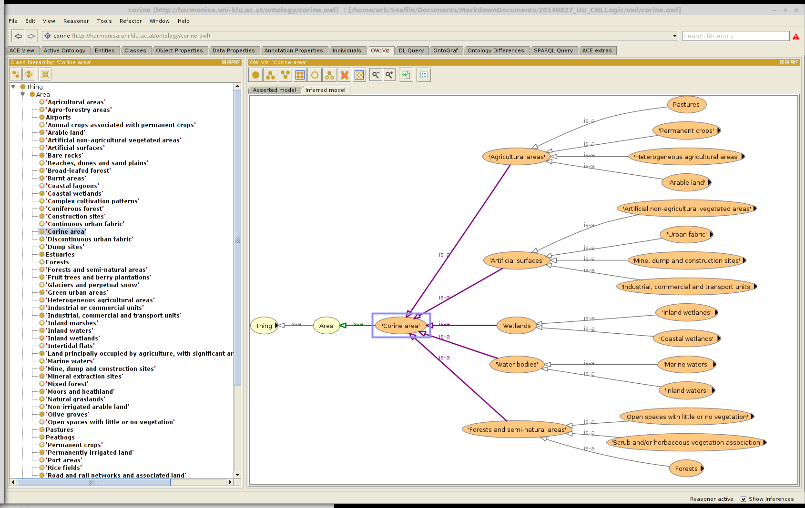

---
title:  '*Proof of Concept*: Controlled Natural Language Logic For Knowledge Engineering At United Utilities'
author: Anthony Beck
tags: Ontology, Business Process, 1Spatial, Knowledge Engineering, CNL
bibliography: ARB_Library.bib
csl: harvard.csl
abstract: |
  
  >Good quality data with a well understood scope leads to better decisions. 

  1Spatial consultants need to rapidly determine a number of things:

  * the actual nature of the data (a data profiling exercise)
  * the expected nature of the data (an 'as-design' data modelling exercise)
  * the business problems which the data is expected to help solve (a business modelling exercise)
  * the business operational processes (an 'as-built' data modelling exercise)^[Not completely happy with this]

  The ability to express rules and logic in syntactically simple phrases is becoming increasingly important to how we develop an understanding and effectively communicating our clients business needs (expecially in helping to distinguish between their pre-conceived and actual need). To facilitate this process 1Spatial uses [*RuleSpeak*](http://www.rulespeak.com/en/) to both capture and communicate business rules. RuleSpeak is an example of a Controlled Natural Language (CNL). The point is to build an understanding of how the business systems are expected to function (the 'as-design' model) and compare this to how they actually function (the 'as-built' model) mediated by the problems the business systems are expected to solve (the business process model). Much of this information is undocumented and needs extracting from domain experts. Domain experts are not knowledge engineers or logicians. CNL helps extract this information in a manner which the domain experts can understand and provide feedback on. Hence, the abstracted model is a closer reflection to reality. 
  
  Whilst the RuleSpeak CNL reduces or removes ambiguity it is only understandable by a human reader^[I don't know of a RuleSpeak Natural Language Processing (NLP) parser]. The Knowledge Engineering community have developed other CNLs which can be used to create Formal Ontologies.

  Ontologies are a way to capture and share people’s knowledge about the world in a way that is processable by computer systems. Ontologies have the potential to serve as a bridge between the human conceptual understanding of the world and the data produced, processed and stored in computer systems. CNL can be used to develop ontologies then we can use to enhance our approaches and improve our services. 
  
  This document describes a proof of concept implementation of the ACE/APE CNL which can be used to derive an OWL formal ontology which in turn can be used for automated reasoning. The data is based upon a real case study from United Utilities based on the Open Water policy initiative.
  
  This proof-of-concept has not been produced on 1Spatial company time. 
  
  This document has been written in [CommonMark](http://commonmark.org/): an unambiguous implementation of Markdown for scholarly writing.
  \newpage
...

\newpage

Distribution list:

* John Daniels (John.Daniels@uuplc.co.uk)
* Stu Mitchell (Stuart.Mitchell@uuplc.co.uk)
* Lee Mooney (Lee.Mooney@uuplc.co.uk)

\newpage

# Expressing knowledge: Rules and Ontologies

The ability to express rules and logic in syntactically simple phrases is becoming increasingly important to how we develop an understanding of clients business needs and then effectively communicating this understanding to our clients. This is particularly important when identifying the difference between a client's pre-conceived need and their actual need (as reflected in the data and the surrounding business processes). To facilitate this 1Spatial use [*RuleSpeak*](http://www.rulespeak.com/en/) to both capture and communicate business rules. RuleSpeak is an example of a Controlled Natural Language (CNL). Whilst Rulespeak reduces or removes ambiguity it is only understandable by a human reader^[I don't know of a RuleSpeak Natural Language Processing (NLP) parser]. There are other CNLs which have been developed in the Knowledge Engineering community which focus on developing Formal Ontologies. This extends the utility of the rules by ensuring they are human *and* computer readable.

Ontologies have been proposed and studied in the last couple of decades as a way to capture and share people’s knowledge about the world in a way that is *computer readable*. This allows *inference engines* to test the *validity* of *facts/statements* and to *infer new knowledge*. Ontologies have the potential to serve as a bridge between the human conceptual understanding of the world and the abstracted view of the world stored in computer systems. 

One of the main reasons for the lack of widespread adoption of ontologies is the steep learning curve for authoring them: most people find it too difficult to learn the syntax and formal semantics of ontology languages. If CNL can be used to develop ontologies then we can produce a more formal and rigorous method of modelling data, conceptual and business processes and sharing these models in meaningful ways with our business partners. 

During a project 1Spatial consultants need to rapidly determine a number of things:

* the actual nature of the data (a data profiling exercise)
* the expected nature of the data (an 'as-design' conceptual modelling exercise)
* the business problems which the data is expected to help solve (a business requirements exercise)
* the business operational processes (an 'as-built' business modelling exercise)^[Not completely happy with this]

This document outlines a proof of concept approach for generating such models.

# Controlled Natural Language systems for Ontology engineering

## Ontology creation

Ontology development requires at least two types of people:

* A knowledge engineer - who can structure the underlying logic that supports the knowledge model
* A domain expert - who has in depth understanding and experience of the phenomena to be modelled

The mathematical nature of description logic has meant that domain experts find them hard to understand. This forms a significant impediment to the creation and adoption of ontologies. Ontology focussed Controlled Natural Language systems constrain language syntax and allow statements to be translated into the Web Ontology Language (OWL) with the aim of achieving both comprehension by domain experts and computational preciseness. 

## The benefit of CNLs for ontology creation

The fundamental principles underlying the use of CNLs for Ontology engineering are (after @denaux_intuitive_2013):

* To allow the domain expert, with the aid of a knowledge engineer and tool support, to express their knowledge as easily and simply as possible and in as much detail as necessary.
* To have a well defined grammar and be sufficiently formal to enable those aspects that can be expressed as OWL to be systematically translatable.
* To be comprehensible by domain experts with little or no knowledge of OWL.
* To be independent of any specific domain.

These principles can be achieved - at least in part. One such example is the use of the Rabbit CNL developed by Ordnance Survey (@hart_rabbit:_2008):

>The original intention was for Rabbit to enable domain experts alone to author ontologies. However, practice showed that whilst domain experts could build ontologies, these ontologies often contained many modelling errors not related to the language but the modelling processes. None-the-less Rabbit still enables the domain expert to take the lead and to author ontologies with guidance in modelling techniques from a knowledge engineer. Rabbit also enables other domain experts to verify the ontology.

## Candidate systems

Two candidate systems were considered:

* [ROO and Rabbit](http://sourceforge.net/projects/confluence/) [@denaux_intuitive_2013, @hart_rabbit:_2008]
* [APE and ACE](http://attempto.ifi.uzh.ch/site/tools/) [@_attempto_2014]

ROO and Rabbit are not as actively developed as APE and ACE. For this reason the proof of concept was undertaken using APE and ACE. Both languages have limitations and a more rigorous review of CNLs and CNL ontology modelling would need to be undertaken if these approaches are implemented by 1Spatial. 

In the future other systems should be reviewed including [Fluent Editor](http://www.cognitum.eu/semantics/FluentEditor/) which includes [CNL for SWRL rule authoring](http://www.cognitum.eu/research/publications/hsi2013_submission_88.pdf).

## Ontology CNLs compared to formal language

CNLs should contain a number of language element. Those used to 

* express axioms
* introduce (or declare) concepts, relationships and individuals
* define relationships between concepts
* define properties of concepts and individuals

The table below contrasts the ACE representation with a "formal language" representation that is normally used in such ontologies. This is intended to show that natural language, if carefully controlled, provides a more readable and writable ontology representation, without a loss in generality and expressive power.

Table: example statements represented in ACE and formal logic notation

ACE notation|Formal logic notation
----|----
Every man is a human.|man $\subseteq$ human
Every human is a male or is a female.|human $\subseteq$ male $\cup$ female
John is a student and Mary is a student.|{John, Mary} $\subseteq$ student
No dog is a cat.|dog $\subseteq$ $\neg$ cat
Every driver owns a car.|driver $\subseteq$ $\exists$ own car
Everything that a goat eats is some grass.|goat $\subseteq$ $\forall$ eat grass
John likes Mary.|\<John, Mary\> $\in$ like
Everybody who loves somebody likes him/her.|love(X, Y) $\implies$ like(X, Y)

## Ontology CNLs compared to RuleSpeak^[Speak to Stephen Stanley about this]

The conclusion of this section should be that Ontology CNLs are no harder to construct than RuleSpeak but provide greater value. However, it is likely that, at least in the short term, RuleSpeak provides more flexibility (i.e. not all concepts may be directly tractable/mappable to OWL ontologies).

## Why ontologies (reasoning and generalisation)

An ontology is a logic framework which provides powerful functionality. The rich model that describes the relationships between and properties of concepts and individuals can be used to generalise data and infer new knowledge. The geographical potential of such approaches are described in detail in -@hart_linked_2013. 

For example Figure \ref{CorineOntology} describes the relationship between the different levels of the Corine land-cover classification hierarchy expressed within an OWL ontology. This encoding can be used to collapse the groupings and generalise the data based upon properties and relations within the ontology. Hence, individual instances can be generalised up the hierarchy.

Inspire is also transitioning into an ontology led framework employing Linked Open Data (LOD).

The reasoning and inference capabilities are powerful. Assertions can be tested for logical validity. Statements can be tested for their validity based upon rules:

* Rule
	* No man is a woman.
* Statements
	* John is a woman.
	* John is a man.

the reasoner will find an inconsistency because John has been asserted as a man and men have been described as disjoint from women. This is shown in Figure \ref{InconsistentLogic}. This complements the rules which can be expressed within 1Spatial's 1Integrate.

Reasoning about transitivity and *HasValue* will find the following text inconsistent (see Figure \ref{InconsistentTransitivity}).

* If something X follows something that follows something Y then X follows Y.
* John follows Mary who follows Bill who follows John.
* No manager follows Mary.
* Bill is a manager.

